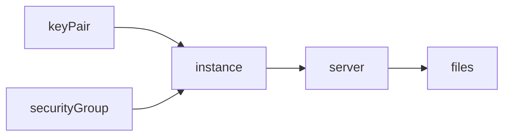

# The start of my cloud journey - launching a hello world service on AWS

## Introduction

I have decided to start with deploying a basic hello world service on AWS. I don't know much about AWS. In general, hello world is the first point of entry for learning a programming language, so why not do that too while learning the cloud? This is from someone who has dabbled a bit with GKE only.

The task I did was the [COM03-AWS100](https://github.com/100DaysOfCloud/100DaysOfCloudIdeas/blob/master/Projects/COM/COM03/COM03-AWS100.md) task.

## Prerequisite

It is good to know how to use SSH, though not entirely necessary since some of the guides tell you how to use it. It's good to have a computer that already has it installed.

It is also good to have some knowledge of shell script and of Linux because once you do get into the remote Linux shell, you don't have a lot of niceties that you have on a normal, personal computer. There is no text editor, so you have to create the HTML file with its header in shell script.

## Use Case

This is the very basis of deploying something on the cloud. You can't get more simple than this. Also, the use case is very common. Instead of just deploying a basic server on a hosted service, you deploy it on a cloud. If you can deploy a static server, you can deploy more complex things later on.

## Cloud Research

- Everything else was completely new to me. I have deployed websites in the past on normal VMs but never on the cloud. It is comparable but in this case I had to deploy my own Apache server rather than having one already set up for me. I felt like I understood more about how security rules work.
- The hardest part for me was getting Apache httpd going. For some reason, when I checked to see if the httpd server was serving, I didn't see it in the network list. It was there though. I saw it running when I did a `top` in the command line.
- The other hard part was figuring out how to get to the right url for my server. There are some links you can click on that make you think that you're going to the right location in your browser and seem handy because they're right in the EC2 console, but they didn't work. Instead I had to copy and paste the urls from the console.
- I am not familiar with some of the find commands that the Amazon tutorial used to change permissions on many files recursively, so that is a neat trick!

## Try yourself

1. Register for amazon web services if you don't have an account. This can take a little bit of time and you have to have a cell phone handy.
2. Go to EC2 console, create a new authentication keypair (either option is fine, just be sure to accept the download when it prompts you). Save the created PEM file somewhere safe, like usually in an `/.ssh` folder in the `HOME` directory.
3. Create a security group with a rule that recognizes your TCP/IP address for enabling inbound SSH. Amazon can automatically detect your public home IP address.
4. Launch the instance with a free-tier Linux AMI and the keypair/security group you just created. Wait until it's created by Amazon.
5. SSH into the console from either a Linux or MacOS terminal using `ssh -i <path_to_ssh_pem> <username>@<instance_public_dns>`. You might have to create a new user for the instance beforehand though you can also use `ec2-user` as a default.
6. Install Apache httpd with first `sudo yum update` and then `sudo yum install httpd` and hit `y` when prompted. Then run with `sudo service httpd start`. You can visit your site by going to `http://<instance_public_dns>` to see if it is running.
7. Once this is installed and running, you will have to set user permissions for your user both in group and for execution/read/write. Do the following: `sudo usermod -a -G apache <username>` so as to add your username to the Apache server. You'll have to log out and then back in.
8. Then set permissions on the `/var/www` folder where all static files will be served by doing: `sudo chown -R <username>:apache /var/www`. Then do: `sudo chmod 2775 /var/www`.
9. Change directory to `/var/www/html` and add the 'Hello world' header with `echo '<h1>Hello world</h1>' >> index.html`.
10. Then go back to your server with the public dns url you used in step 6 to see if it works.

## ☁️ Cloud Outcome

I learned a lot by doing this. First, I don't know the names of the different aws services so now I know of one, other than S3. Now I know how to deploy an Apache server on an EC2 instance and how to serve a basic HTML file. I also have an idea of how to set up the basic security rules to block unwanted inbound SSH connections. Not bad for two hours's work for someone who is just starting out!

## Next Steps

I'd like to see how to use aws with Docker so I think I'd like to do the Docker image/ECR repository task.
